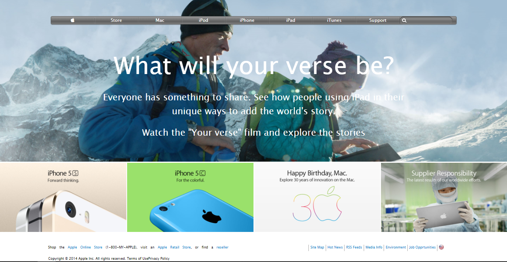

# Collaborative Project: Apple clone

> This is a microverse student project for working with Positioning and Floating Elements



> This project clones the apple.com old page interface design.
> The project includes the header, the main content and the footer as it's main features.

## Built With

- HTML
- CSS

## Live Demo

[Live Demo Link](https://rawcdn.githack.com/EraaniR/apple-clone/6384e1e276590df6008ba48952d7ae8a39c9299e/index.html)

## Getting Started

To get a local copy up and running follow these simple example steps.

### Prerequisites

> Browser
> Text editor of your choice.
> npm has to be installed in your system.
> install linters on your IDE.

### Setup

> `git clone https://github.com/EraaniR/apple-clone.git`

### Usage

> Open the index.html from your browser.

### Run tests

Run `npx html-validator-cli --quiet --file index.html` to run the validator over the `index.html` file.

The `--quiet` will only list `errors`. If you also want to see the warnings use the `--verbose` flag instead.
As an alternative, you can also install the `html5validator` using `pip`:

```
pip install --user html5validator
html5validator index.html
```

## Authors

👤 **Okusa J. Robert**

- Github: [@ojrdev](https://github.com/ojrdev)

👤 **Eraani Ruiz**

- Github: [@eraanir](https://github.com/eraanir)

## 🤝 Contributing

Contributions, issues and feature requests are welcome!

Feel free to check the [issues page](https://github.com/EraaniR/apple-clone/issues).

## Show your support

Give a ⭐️ if you like this project!

## 📝 License

This project is [MIT](lic.url) licensed.